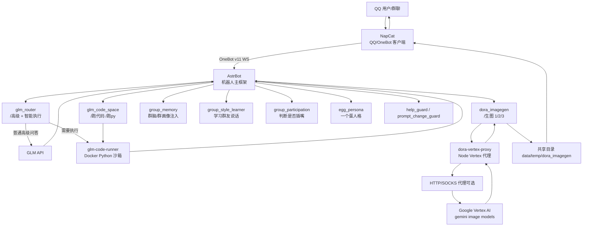

# QQ Bot AI Suite

一套 Docker 化的 QQ AI Bot 产品化骨架，基于 AstrBot + NapCat，集成本地 LLM、GLM 高级问答、Google Vertex 生图、Docker 代码执行沙箱和一组安全/体验插件。

## 功能

- QQ 接入：NapCat + OneBot v11 reverse WebSocket
- 主框架：AstrBot
- 普通聊天：本地 Ollama/Gemma OpenAI-compatible provider
- 高级问答：`/高级`、`/深度`、`/glm` 走 GLM provider
- 智能代码执行：`/高级 计算/运行/验证...` 自动进入 Docker Python 沙箱
- 显式代码执行：`/跑代码 ...`、`/跑py ...`
- 生图：`/生图 1/2/3 prompt`，按档位调用 Google Vertex 图片模型
- 群聊保护：群里屏蔽 `/help`、`/plugin`、`/sid`
- “一个蛋”群友人格：真人短句、熟人吐槽、复杂问题认真答
- 群记忆/群脑：自动记录群聊、周期总结、回答前注入群画像
- 群风格学习：学习群口癖、句长、吐槽方式
- 参与策略：别人问它会答，平时按冷却偶尔插嘴
- Dora SSR 小游戏：`/做游戏 ...` 生成项目，Docker Runtime + noVNC 网页预览
- Prompt 修改保护、红队模式、Gemma 闲聊风格优化

## 命令速览

```text
/生图 1 熊猫震惊表情包          # 快速档
/生图 2 一只穿宇航服的橘猫      # 标准档，默认
/生图 3 赛博朋克城市夜景海报    # 精细档

/高级 帮我分析这个架构瓶颈
/高级 计算 2**100 是多少
/跑代码 模拟投骰子 1000 次
/跑py print(sum(range(101)))

/群记忆 查看
/群记忆 总结
/群记忆 清空

/群风格 查看
/群风格 总结

/参与策略 查看
/参与策略 安静|正常|活跃|嘴欠

/做游戏 做一个躲避弹幕小游戏，玩家是猫，30秒计分
/游戏 状态 <id>
/游戏 日志 <id>
/游戏 停止 <id>
```

## 架构



更多说明见 [docs/ARCHITECTURE.md](docs/ARCHITECTURE.md)。

## 快速部署

> 仓库不包含任何 token、QQ 数据、Google service account JSON、NapCat 运行数据。

```bash
cp .env.example .env
./scripts/bootstrap-data.sh
```

然后编辑：

- `.env`
- `data/config/*.json`
- `secrets/gcp-service-account.json`
- `secrets/glm_code_runner.token`

启动：

```bash
docker compose -f docker-compose.example.yml up -d
./scripts/doctor.sh
```

如果 `dora-vertex-proxy` 使用 `network_mode: host`，AstrBot 容器访问宿主 8877 被防火墙拦截时，可执行：

```bash
./scripts/allow-vertex-proxy-from-docker.sh
```

## 生图档位

| 档位 | 命令 | 模型 | 用途 |
|---|---|---|---|
| 1 快速 | `/生图 1 ...` | `gemini-2.5-flash-image` | 表情包、头像、简单图 |
| 2 标准 | `/生图 2 ...` | `gemini-2.5-flash-image` | 默认均衡 |
| 3 精细 | `/生图 3 ...` | `gemini-3.1-flash-image` | 复杂场景、海报、参考图重绘 |

## 目录

```text
plugins/                     AstrBot 插件（含 group_memory 群脑）
services/dora-vertex-proxy/   Google Vertex 图片代理
services/glm-code-runner/     Docker Python 代码执行服务
config/examples/              已脱敏配置模板
scripts/                      部署/检查脚本
docs/                         架构文档
```

## 安全注意

- 不要提交 `.env`、`secrets/`、`data/`、`ntqq/`。
- 代码执行服务默认无网络、只读挂载、低权限、短超时。
- `/高级` 自动执行默认只开放给配置里的管理员 QQ 号。

## Dora SSR 小游戏 Runtime

`/做游戏` 使用 GLM 生成 Dora Lua 项目，通过 `dora-game-gateway` 启动一个短生命周期 Docker 容器运行 Dora SSR native runtime，并用 Xvfb + noVNC 输出网页预览。详见 [`docs/DORA_GAME_RUNTIME.md`](docs/DORA_GAME_RUNTIME.md)。
