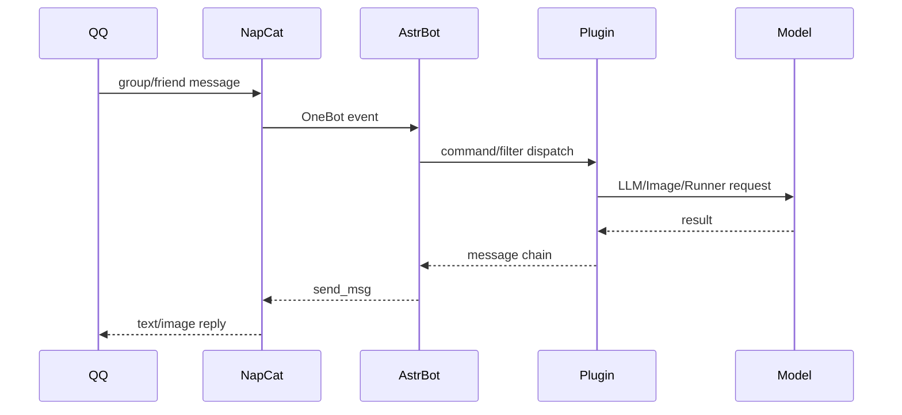
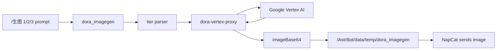
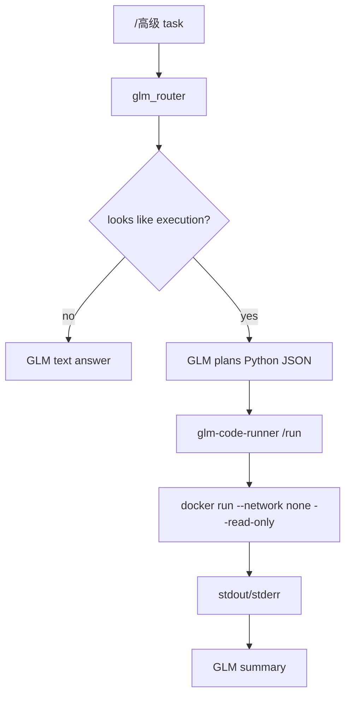
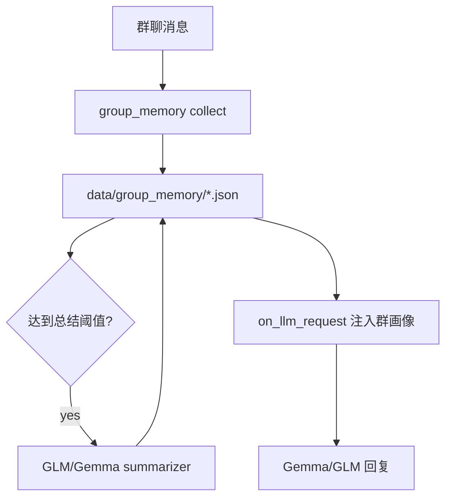
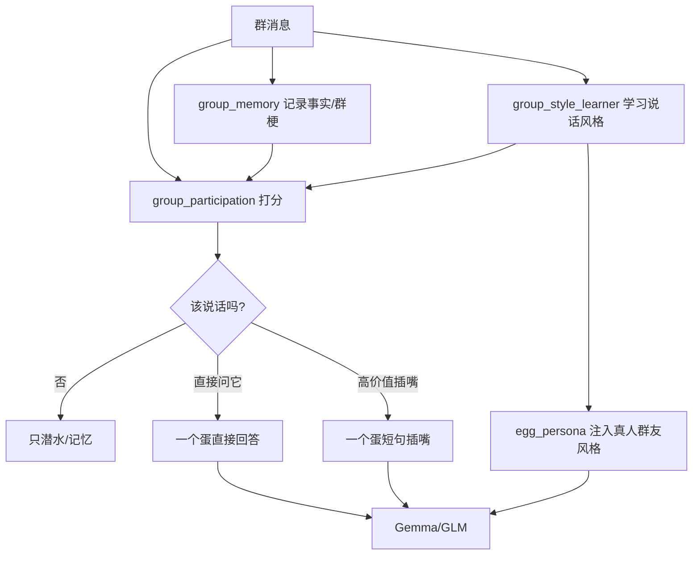

# Architecture

## Runtime services

| Service | Role |
|---|---|
| `napcat` | QQ 登录与 OneBot v11 适配 |
| `astrbot` | Bot 主框架、插件运行时、会话管理 |
| `ollama-gemma4` | 可选本地 OpenAI-compatible LLM |
| `dora-vertex-proxy` | Google Vertex 图片模型代理 |
| `glm-code-runner` | Python 代码执行沙箱调度器 |
| `group_memory` plugin | 群消息记忆、周期总结、回答前注入群画像 |
| `group_style_learner` plugin | 学习群友说话风格、口癖、句长、禁忌表达 |
| `group_participation` plugin | 参与策略：直接问答、偶尔插嘴、冷却控制 |
| `egg_persona` plugin | “一个蛋”群友型人格注入 |

## Message flow

## Image generation flow

## Advanced GLM + code execution

## Group memory flow

## Egg persona / participation flow

